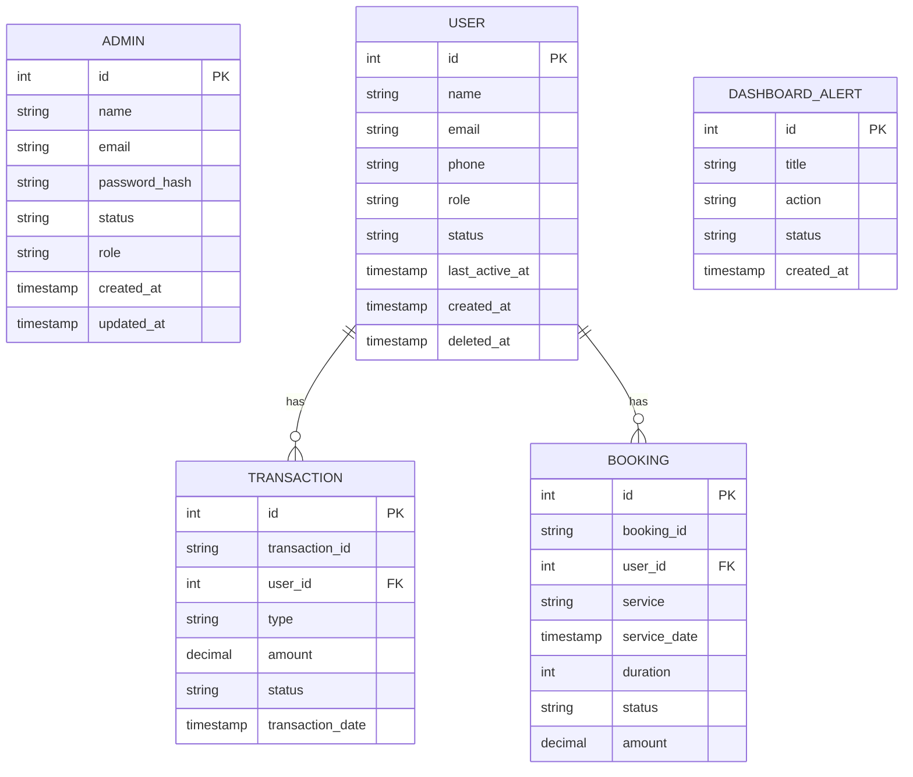

# ER Diagram

The project uses a simple integer primary-key schema. The PNG is included as `er-diagram.png` and the source is `ER-DIAGRAM.dot`.

```mermaid
erDiagram
    ADMIN { int id PK string name string email string password_hash string status string role timestamp created_at timestamp updated_at }
    USER { int id PK string name string email string phone string role string status timestamp last_active_at timestamp created_at timestamp deleted_at }
    TRANSACTION { int id PK string transaction_id int user_id FK string type decimal amount string status timestamp transaction_date }
    BOOKING { int id PK string booking_id int user_id FK string service timestamp service_date int duration string status decimal amount }
    DASHBOARD_ALERT { int id PK string title string action string status timestamp created_at }
    USER ||--o{ TRANSACTION : has
    USER ||--o{ BOOKING : has
```
